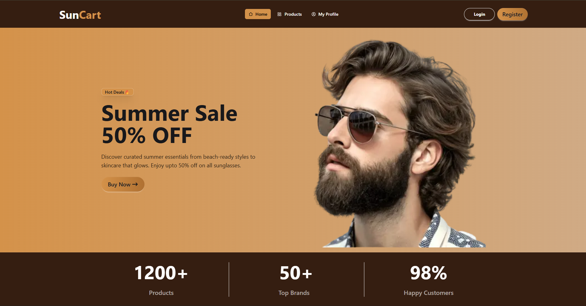

# SunCart - Summer Essentials Store

A modern, full-featured summer eCommerce platform built with Next.js, featuring product browsing, protected routes, and multi-provider authentication via BetterAuth.

---

## Live Links

- Live Demo: https://ph-a08-b13.vercel.app/
- Client Repository: https://github.com/yashakib-dev/PH-A08-B13

---

## Preview



---

## Demo Credentials

- **User Email:** demo.user@example.com  
- **User Password:** Demo@12345  

> Note: Demo credentials are for testing purposes only. Do not use real user data.

---

## Project Overview

SunCart is a seasonal eCommerce web application where users can explore and purchase summer essentials - including sunglasses, beach outfits, skincare products, and accessories. The platform provides a seamless shopping experience with authentication-protected product detail pages, category filtering, and a clean warm-espresso themed UI.

---

## Key Features

- Home Page: Animated hero banner with summer sale highlights, popular products section, summer care tips, and top brand showcases
- Protected Product Detail: Full product detail page accessible only to authenticated users; unauthenticated users are redirected to login and returned after sign-in
- Authentication (Better Auth): Email/password login & registration with form validation, error toasts, and Google OAuth
- User Profile: Displays account info for logged-in users
- Responsive Design: Fully responsive layout across desktop, tablet, and mobile
- Warm Espresso Theme: Custom color system using #351E11, #D4924A, #FFF8F1

---

## Tech Stack

### Frontend
- Next.js
- Tailwind CSS
- DaisyUI
- Better Auth
- React Icons
- React Hot Toast
- React Hook Form
- Animation.css


### Authentication
- Better Auth
- Google Authentication

### Deployment
- Vercel

### Tools
- Git
- GitHub
- VS Code

---

## Main Pages

- Home Page
- Product Listing Page
- Product Details Page
- Login Page
- Register Page
- Profile Page

---

## Setup Instructions

### 1. Clone the repository
```bash
git clone https://github.com/yashakib-dev/PH-A08-B13.git
```
2. Install dependencies
```bash
npm install
```
3. Run the project
```bash
npm run dev
```


## Testing
- User can register and log in
- Protected routes redirect unauthenticated users
- Data loads correctly
- Mobile layout works properly


## Author
Name: Yeakub Ali Shakib <br>
Portfolio: https://ya-shakib-portfolio.vercel.app/ <br>
LinkedIn: https://www.linkedin.com/in/yashakib/ <br>
GitHub: https://github.com/yashakib-dev
